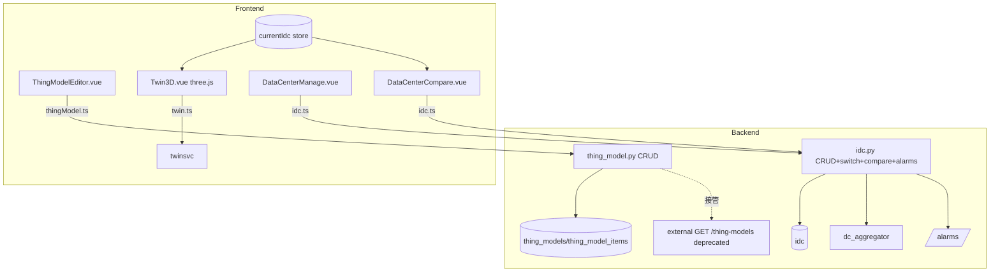

## 用户需求

实现三大能力：物模型可视化编辑、3D 数字孪生拓扑、多数据中心管理。

## 产品概述

在 dc-ioc-platform 现有平台基础上，新增物模型全生命周期管理（落库+图形化编辑器）、基于 three.js 的机房级 3D 孪生拓扑（旋转/缩放/分层+实时数据映射）、以及多数据中心的完整后台管理（增删改查/切换/跨中心对比/统一告警）。

## 核心功能

### 一、物模型可视化修改

- 后端新增物模型数据库表（含属性/服务/事件三类成员），提供 CRUD 接口并接管原只读 GET /thing-models。
- 前端图形化编辑器：列表+表单抽屉，支持增/删/改物模型及其属性、服务、事件。
- 实时预览面板：编辑时即时渲染物模型 JSON 结构树。
- 结构校验：名称唯一性、必填字段、非法字符、属性/服务/事件类型一致性校验，保存前提示。

### 二、3D 数字孪生拓扑

- 引入 three.js，在孪生页构建 3D 机房场景（机柜/设备/链路以立体几何体呈现）。
- 交互：鼠标拖拽旋转、滚轮缩放、分层（按 IDC/房间/机柜层级）显隐切换。
- 实时数据映射：轮询或 WebSocket 将设备实时指标染色/标注到 3D 模型（如温度高亮、离线置灰）。

### 三、多数据中心管理

- 后端新增 IDC CRUD 接口、当前数据中心切换接口、跨中心聚合对比接口、统一告警汇总接口。
- 前端多中心管理页：增/改/删/启停数据中心，切换当前中心（全局生效）。
- 跨中心对比仪表盘：各中心电力/制冷/机柜/告警数的并排对比（图表+表格）。
- 统一告警视图：聚合各中心活跃告警与运行状态。

## 技术栈选择

- 前端：Vue3 + TypeScript + Vite + Tailwind + 现有 @dc-ioc/ui 组件库（沿用项目规范，抽屉/弹窗居中、页面相近底色）。
- 3D：three.js（^0.16x）+ 轻量 OrbitControls（旋转/缩放），零 token、体积可控、契合机房内部拓扑。
- 后端：FastAPI + SQLAlchemy + Pydantic（沿用 existing patterns）。
- 状态：前端 pinia store 保存“当前数据中心”，写接口用 require_role，依赖注入用 get_db。

## 实现方案

### 总体策略

分三条独立垂直链路落地，互不耦合：物模型（models/CRUD/api + 编辑器）、3D 拓扑（前端 three.js 场景 + 复用 twin 服务）、多数据中心（IDC 扩展 + 管理/对比/告警前端）。后端新模块严格遵循 router.py 注册 + models/**init**.py 注册 + lifespan 自动建表（新表无需 ALTER）的既有约定，避免此前整个 app 500 的坑。

### 关键技术决策

1. **物模型落库结构**：采用主表 `thing_models` + 子表 `thing_model_items`（type 区分 property/service/event，统一存 name/identifier/data_type/desc/unit/jsonb 扩展）。相比拆三张表，迁移与编辑器更简单，查询一次出全结构。
2. **接管 GET /thing-models**：新 `thing_model.py` 端点返回 DB 数据；保留 external.py 只读出口但标注 deprecated，前端注册表单（CollectorDeviceForm）改为读取后端物模型 API，消除前后端双重硬编码不一致。
3. **3D 分层**：场景按 idc→room→cabinet→device 层级 group 嵌套，分层开关控制 group.visible；实时数据用节流轮询（已有 ws 或每 3~5s /api 拉取）更新材质颜色，避免每帧重渲。
4. **多数据中心**：复用 `dc_aggregator.domain_overview` 按 center 过滤聚合；切换中心写入前端 store + 后端 `/api/idc/current` 持久化，影响拓扑/监控默认范围。统一告警复用 `/alarms` 按 idc_id 过滤聚合。

### 性能与可靠性

- 3D 场景：设备数量级百~千，用 InstancedMesh 或合并几何体降低 draw call；实时映射仅改 material.color/emissive，不重建几何。
- 物模型/IDC 列表加分页或按需加载，避免全量返回。
- 后端写接口统一 try/except + 事务回滚；校验失败返回 422 明确字段。
- 新增依赖 three 仅前端打包，注意 Docker 前端容器重建后需重跑 npm i 并重启、清 .vite 缓存、重建 @dc-ioc/ui 软链（历史坑）。

## 实现注意事项

- 新后端模块在 `api/v1/router.py` 注册，确保 import 无循环依赖；写端点加 `dependencies=[Depends(require_role(...))]`。
- 新模型必须在 `models/__init__.py` 的 import 与 `__all__` 注册，否则 create_all 不建表。
- 前端抽屉/弹窗沿用已修复的 `.drawer-mask`（居中、半透明页面色、blur），不要回退为右上角透明。
- three.js 场景组件卸载时 dispose 几何/材质/renderer，防内存泄漏。
- 前端 i18n 新增 key 同步 zh-CN.json / en-US.json。

## 架构设计



## 目录结构

```
backend/app/
├── models/
│   ├── thing_model.py   # [NEW] ThingModel + ThingModelItem(type: property/service/event) 表
│   ├── idc.py            # [MODIFY] 维持现状，必要时补 current_center 字段或放 setting 表
│   └── __init__.py       # [MODIFY] 注册 ThingModel/ThingModelItem
├── schemas/
│   ├── thing_model.py    # [NEW] ThingModel/Item 读写 schema（含属性/服务/事件）
│   └── idc.py            # [NEW] IdcCreate/Update/Out/CompareOut 等
├── crud/
│   ├── thing_model.py    # [NEW] list/get/create/update/delete + 批量 upsert items
│   └── idc.py            # [NEW] IDC CRUD + 聚合对比查询
└── api/v1/endpoints/
    ├── thing_model.py    # [NEW] GET/POST/PUT/DELETE /api/thing-models，接管原只读
    ├── idc.py            # [NEW] IDC CRUD + /current + /compare + /alarms 统一告警
    └── router.py         # [MODIFY] include_router 注册 thing_model / idc

frontend/src/
├── api/
│   ├── thingModel.ts     # [NEW] 物模型 CRUD 封装
│   └── idc.ts            # [NEW] 数据中心 CRUD/切换/对比/告警封装
├── stores/
│   └── datacenter.ts     # [NEW] 当前数据中心 store（pinia）
├── views/ops/
│   ├── ThingModelEditor.vue     # [NEW] 图形化编辑器+预览+校验
│   ├── DataCenterManage.vue     # [NEW] 多中心管理/切换
│   └── DataCenterCompare.vue    # [NEW] 跨中心对比仪表盘+统一告警
├── views/twin/
│   └── Twin3D.vue        # [NEW] three.js 3D 拓扑场景（旋转/缩放/分层/实时映射）
├── constants/thingModels.ts     # [MODIFY] 改为从后端加载或仅保留兼容兜底
├── router/index.ts       # [MODIFY] 注册 thing-model / datacenter / twin3d 路由
├── i18n/locales/zh-CN.json  # [MODIFY] 新增 i18n key
└── package.json          # [MODIFY] 增加 three 依赖
```

## 关键代码结构（接口级）

```python
# backend/app/models/thing_model.py
class ThingModel(Base, TimestampMixin):
    __tablename__ = "thing_models"
    id: Mapped[int]
    key: Mapped[str]          # 唯一，如 chiller
    name: Mapped[str]
    category: Mapped[str]
    domain: Mapped[str]
    protocol: Mapped[str]
    vendor: Mapped[str]
    model: Mapped[str]
    items: Mapped[List["ThingModelItem"]]  # cascade

class ThingModelItem(Base, TimestampMixin):
    __tablename__ = "thing_model_items"
    id: Mapped[int]
    thing_model_id: Mapped[int]
    item_type: Mapped[str]    # property | service | event
    identifier: Mapped[str]
    name: Mapped[str]
    data_type: Mapped[str]    # float/int/bool/string/enum/command
    unit: Mapped[str]
    desc: Mapped[str]
    extra: Mapped[dict]       # jsonb 扩展（如 enum 值域、服务入参）
```

## 设计风格

采用科技感数据中心的深色 Glassmorphism 风格（深蓝/青色玻璃面板 + 微发光），与现有平台监控大屏一致。三大新页面统一顶部导航与左侧功能入口，弹窗/抽屉居中、半透明页面底色+背景模糊。3D 拓扑页以全屏深色画布为主，叠加可折叠控制面板（分层开关、实时图例）。物模型编辑器采用左列表+中表单+右实时预览三栏布局。多数据中心页采用卡片网格（中心概览）+ 对比仪表盘（并排指标卡与柱状/折线对比）。

## 页面规划

1. 物模型编辑器（ThingModelEditor）：顶部搜索/新建；左栏模型列表；中栏属性/服务/事件 Tab 表单（增删行）；右栏实时 JSON 结构树预览 + 校验提示。
2. 3D 数字孪生拓扑（Twin3D）：全屏 three.js 画布；悬浮控制条（旋转/缩放复位、分层下拉、实时数据开关）；点击设备弹出信息卡（指标+状态）。
3. 多数据中心管理（DataCenterManage）：中心卡片网格（名称/地域/容量/状态），新建/编辑抽屉，设为当前按钮。
4. 跨中心对比（DataCenterCompare）：所选中心并排 KPI 卡 + 电力/制冷/机柜/告警对比图表 + 统一告警滚动列表。