# 5.1.2 数据库 ER 图（概念关系）

> 基于 `app/models/*` 反射生成，覆盖 27 张表的核心实体与关联关系（外键 / 逻辑关联）。
> 使用 Mermaid `erDiagram` 语法，可直接在支持 Mermaid 的 Markdown 渲染器（GitHub / VS Code）查看。

```mermaid
erDiagram
    %% ===== 认证与审计 =====
    users ||--o{ user_roles : has
    roles ||--o{ user_roles : assigned
    roles ||--o{ role_permissions : grants
    permissions ||--o{ role_permissions : referenced_by
    users ||--o{ audit_logs : generates
    users ||--o{ session_history : owns

    %% ===== 机房/资产拓扑 =====
    idcs ||--o{ rooms : contains
    rooms ||--o{ cabinets : houses
    cabinets ||--o{ servers : mounts
    cabinets ||--o{ cabinet_pdu : powers
    servers ||--o{ server_nics : has
    servers ||--o{ flow_records : produces
    idcs ||--o{ idc_links : connects

    %% ===== 监控点位与遥测 =====
    equipment ||--o{ point_data : emits
    equipment ||--o{ realtime_metrics : streams
    equipment ||--o{ external_devices : maps
    external_devices ||--o{ external_thing_models : described_by
    external_devices ||--o{ external_metrics : reports

    %% ===== 告警与联动 =====
    equipment ||--o{ alarm_events : triggers
    alarm_events ||--o{ tickets : converts_to
    alarm_rules ||--o{ alarm_events : evaluated_against

    %% ===== 工单/运维 =====
    users ||--o{ tickets : owns
    tickets ||--o{ tickets : parent_of
    inspection_plans ||--o{ inspection_items : defines
    inspection_items ||--o{ inspection_results : produces
    shift_groups ||--o{ shifts : schedules
    users ||--o{ shift_participants : participates
    shifts ||--o{ shift_participants : includes
    drill_plans ||--o{ drill_records : executed_as
    risks ||--o{ risk_controls : mitigated_by
    maintenance_plans ||--o{ maintenance_records : generates

    %% ===== 知识库与指导书 =====
    knowledge ||--o{ knowledge_versions : versions

    users {
        int id PK
        string username
        string role
        string hashed_password
        boolean is_active
        string created_at
    }
    roles {
        int id PK
        string name
        string description
    }
    permissions {
        int id PK
        string name
        string resource
        string action
    }
    audit_logs {
        int id PK
        int user_id FK
        string action
        string resource
        string detail
        string created_at
    }
    idcs {
        int id PK
        string name
        string location
        string status
    }
    rooms {
        int id PK
        int idc_id FK
        string name
        string purpose
    }
    cabinets {
        int id PK
        int room_id FK
        string code
        string status
    }
    servers {
        int id PK
        int cabinet_id FK
        string hostname
        string asset_no
        string status
    }
    equipment {
        int id PK
        string name
        string category
        string model
        string location
    }
    point_data {
        int id PK
        int equipment_id FK
        string metric
        float value
        timestamp time
    }
    realtime_metrics {
        int id PK
        int equipment_id FK
        string metric
        float value
        timestamp ts
    }
    external_devices {
        int id PK
        int equipment_id FK
        string device_id
        string status
    }
    external_thing_models {
        int id PK
        string model_id
        string name
    }
    external_metrics {
        int id PK
        int device_id FK
        string metric
        float value
        timestamp ts
    }
    alarm_events {
        int id PK
        int equipment_id FK
        int rule_id FK
        string level
        string state
        timestamp triggered_at
    }
    alarm_rules {
        int id PK
        string name
        string metric
        string condition
    }
    tickets {
        int id PK
        string title
        string sys
        string lv
        string state
        string owner
        int source_alarm_id FK
        int parent_id FK
    }
    inspection_plans {
        int id PK
        string name
        string cycle
    }
    inspection_items {
        int id PK
        int plan_id FK
        string content
    }
    inspection_results {
        int id PK
        int item_id FK
        string result
    }
    shift_groups {
        int id PK
        string name
    }
    shifts {
        int id PK
        int group_id FK
        string date
    }
    shift_participants {
        int id PK
        int shift_id FK
        int user_id FK
    }
    drill_plans {
        int id PK
        string name
        string type
    }
    drill_records {
        int id PK
        int plan_id FK
        string result
    }
    risks {
        int id PK
        string title
        string level
        string status
    }
    risk_controls {
        int id PK
        int risk_id FK
        string measure
    }
    maintenance_plans {
        int id PK
        string name
        string freq
    }
    maintenance_records {
        int id PK
        int plan_id FK
        string result
    }
    knowledge {
        int id PK
        string code
        string title
        string category
        string domain
    }
    knowledge_versions {
        int id PK
        int knowledge_id FK
        string version
        string content
    }
    session_history {
        int id PK
        int user_id FK
        string ip
        string login_at
    }
```

## 关系说明

| 关系 | 类型 | 说明 |
| --- | --- | --- |
| users ↔ roles | 多对多 | 经 `user_roles` 关联表 |
| roles ↔ permissions | 多对多 | 经 `role_permissions` 关联表 |
| idcs → rooms → cabinets → servers | 一对多层级 | 物理拓扑树 |
| equipment → point_data / realtime_metrics | 一对多 | 遥测时序数据 |
| equipment → external_devices | 一对多 | 外部接入设备映射 |
| alarm_events → tickets | 一对多 | 告警可转工单 |
| tickets → tickets | 自引用 | 父子工单 |
| inspection_plans → items → results | 一对多链 | 巡检计划执行链 |
| shifts ↔ users | 多对多 | 经 `shift_participants` |
| knowledge → knowledge_versions | 一对多 | 指导书版本管理 |

> 说明：部分关系为逻辑关联（如 `alarm_events.source_alarm_id` 在告警引擎内存态与数据库混合），上图以数据库外键为主，逻辑关联在代码层实现（见 `app/services/alarm_engine.py`）。
